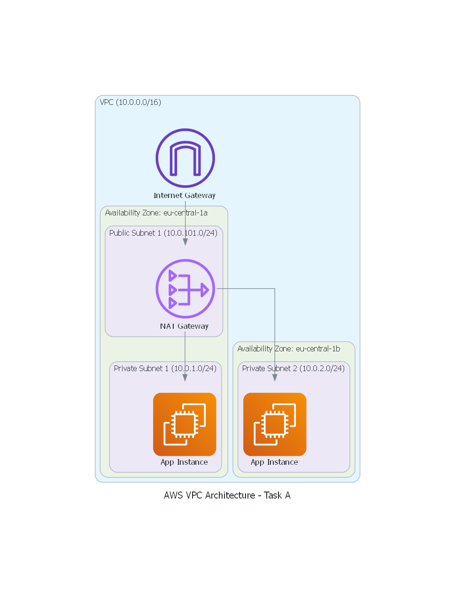

# Task A: Terraform-managed AWS VPC

## Overview
This task involves creating a secure and scalable AWS networking infrastructure using Terraform. The setup follows cloud best practices by separating resources into public and private tiers to enhance security as required by the assignment.

## Architecture Diagram
The following diagram illustrates the infrastructure components, including the VPC, subnets, and gateways.

## Infrastructure Components
* **VPC**: A Virtual Private Cloud with a CIDR block of `10.0.0.0/16`.
* **Public Subnets**: Two subnets (one per AZ) for resources that need to be reached from the internet.
* **Private Subnets**: Two subnets (one per AZ) for backend application servers.
* **Internet Gateway (IGW)**: Provides internet access for the public subnets.
* **NAT Gateway**: Allows instances in private subnets to access the internet for updates while preventing unsolicited inbound traffic.

## Technical Decisions
* **Terraform Modules**: I utilized the official `terraform-aws-modules/vpc/aws` module to ensure a maintainable and battle-tested configuration.
* **Variables**: All key parameters like CIDR blocks and regions are externalized in `variables.tf` for reusability.
* **Cost Optimization**: In `main.tf`, `single_nat_gateway` is set to `true`. While a production environment would typically use one NAT Gateway per AZ for high availability, this setting significantly reduces costs for this demonstration.
* **Clean Repository**: A `.gitignore` file is implemented at the root level to ensure that environment-specific files (like `.terraform/`, `.tfstate`, and `.terraform.lock.hcl`) are not tracked. This follows the DevOps principle of keeping the repository lean and tool-agnostic.

## How to Verify
1.  **Initialize**: Run `terraform init` to download the required providers and modules.
2.  **Validate**: Run `terraform validate` to check the syntax and configuration logic.
3.  **Plan**: Run `terraform plan` to preview the infrastructure changes.